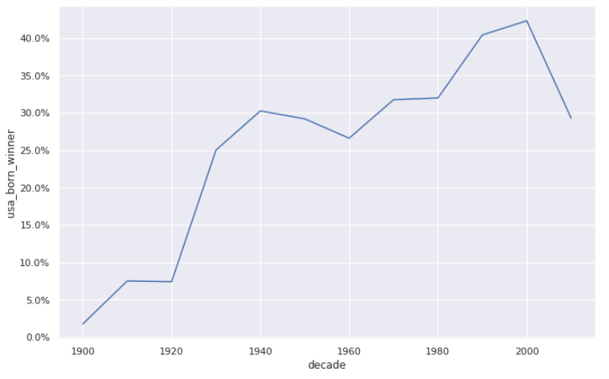
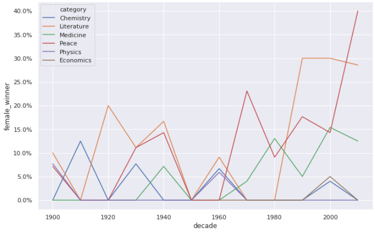
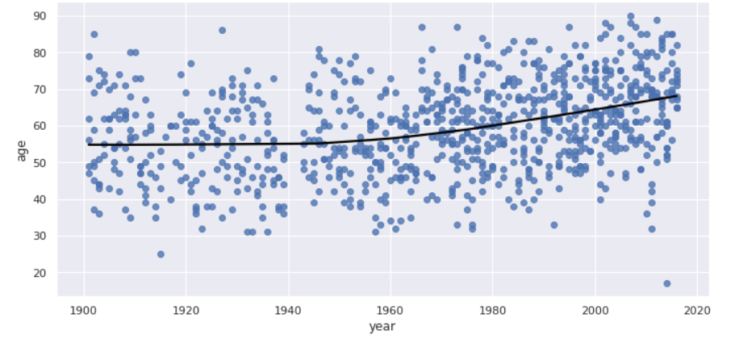

## A Visual History of Nobel Prize Winners
- ### Overview and Goal :
The Nobel Prize is perhaps the world's most well known scientific award. Except for the honor, prestige and substantial prize money the recipient also gets a gold medal showing Alfred Nobel (1833 - 1896) who established the prize.

Every year it's given to scientists and scholars in the categories chemistry, literature, physics, physiology or medicine, economics, and peace. The first Nobel Prize was handed out in 1901, and at that time the Prize was very Eurocentric and male-focused, but nowadays it's not biased in any way whatsoever. Surely. Right?

- ### USA dominance, visualized :
The most common Nobel laureate between 1901 and 2016 was a man born in the United States of America. But in 1901 all the winners were European. When did the USA start to dominate the Nobel Prize charts?

- ### Female Nobel Prize winners :
So the USA became the dominating winner of the Nobel Prize first in the 1930s and had kept the leading position ever since. But one group that was in the lead from the start, and never seems to let go, are men.

Maybe it shouldn't come as a shock that there is some imbalance between how many male and female prize winners there are, but how significant is this imbalance? And is it better or worse within specific prize categories like physics, medicine, literature, etc.?

- ### How old are they when you got the prize?
The list of repeat winners contains some illustrious names! Marie Curie, who got the prize in physics for discovering radiation and in chemistry for isolating radium and polonium. Organizations like Red Cross and the UNHCR also have gotten it twice.

But how old are they generally when they got the prize?

